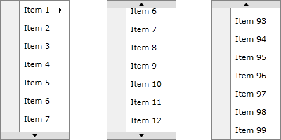

# Task: Create simple context menu on pure JavaScript.

## Requirements:
-	You can`t use any libraries - only pure JS
-	menu should be configurable (for example  JSON)

    -	config options
        -	element on which will appear context menu
        -	menu items
        -	item click handler
        -	item title
        -	item can be disabled
        -	may be a submenu
-	if you click another place except menu it should close
-	menu should appear near the cursor when right mouse button is clicked
    - scrolling should happen when user click up/down arrow
when up/down arrow clicked menu must scroll by 1 item up/down
    -	If the menu does not fit into the screen custom scroll should appear

-	If it's not possible to expand menu down / right side it should be expanded up / left and vise versa
-	solution should be cross-browser (Chrome, Firefox, IE11+)
